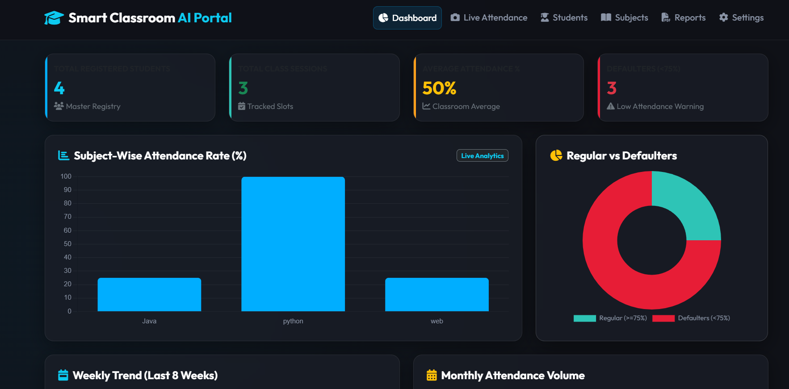
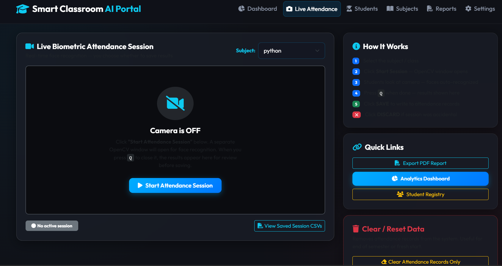

# Smart Classroom AI Portal 🎓📷



A comprehensive, enterprise-grade **Face Recognition & Biometric Attendance System** built specifically for modern classrooms. Upgraded from a legacy Tkinter desktop application to a full-stack **Flask web application**, this project features a sleek, dark-themed glassmorphic UI, real-time AI face tracking, and advanced attendance analytics.

---

## 🌟 Key Features

* **Live AI Biometric Attendance**: Real-time webcam streaming with OpenCV's LBPH Face Recognizer running directly on the backend and streaming to the browser via MJPEG.
* **Smart Session Management**: Prevents accidental attendance logs. Instructors must explicitly choose to **Save** or **Discard** attendance records after the face tracking session ends.
* **Modern Dashboard & Analytics**: Interactive `Chart.js` visualizations showing Weekly Trends, Monthly Volume, Subject-wise rates, and Defaulter Ratios.
* **Student Registry & Search**: Easily add, edit, and delete students. Capture 50 face samples automatically and retrain the AI model in one click. Look up students instantly with the live search bar.
* **Data Drill-Down**: Click on any subject in the dashboard to drill down into its raw session CSV files for granular attendance auditing.
* **Automated Defaulter Emails**: One-click action to send HTML warning emails to parents of students with `< 75%` attendance.
* **PDF Report Generation**: Export official Attendance Summary Reports as PDFs instantly.



## 🛠️ Technology Stack

* **Backend**: Python, Flask, OpenCV (cv2), Pandas
* **AI Model**: Haar Cascade for Face Detection, LBPH (Local Binary Pattern Histogram) for Face Recognition
* **Frontend**: HTML5, Vanilla CSS (Glassmorphism), JavaScript, Bootstrap 5
* **Data Visualization**: Chart.js
* **Storage**: CSV-based lightweight database structure (`StudentDetails.csv`, `Master_Attendance.csv`)

---

## 🚀 How to Run Locally

### 1. Prerequisites
Ensure you have Python 3.8+ installed. You also need a working webcam.

### 2. Install Dependencies
```bash
pip install -r requirements.txt
```
*(Dependencies usually include: `flask`, `opencv-contrib-python`, `pandas`, `reportlab`, `matplotlib`)*

### 3. Run the App
```bash
python app_web_full.py
```
Open your browser and navigate to `http://127.0.0.1:5000`

---

## 📖 Workflows

### Registering a Student
1. Go to the **Students** tab.
2. Click **Register New Student**.
3. Fill in the USN/ID, Name, Subject, and Parent Contact details.
4. Click **Start Camera**, then **Capture 50 Face Samples & Train AI**.
5. The system will automatically capture faces, build the dataset, and retrain the model!

### Taking Attendance
1. Go to the **Live Attendance** tab.
2. Select the subject/class and click **Start Session**.
3. A live OpenCV Face Tracking window will appear. It will highlight known faces in green and unknown in red.
4. Press **Q** when the class has entered.
5. Review the captured students in the web portal and click **✅ SAVE Attendance** to write to the CSV log.

---

*Note: For the automated email feature, you must configure your Gmail and 16-character App Password in the Settings or Overview tab.*
